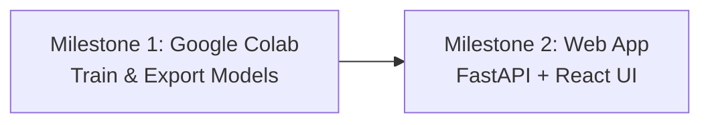
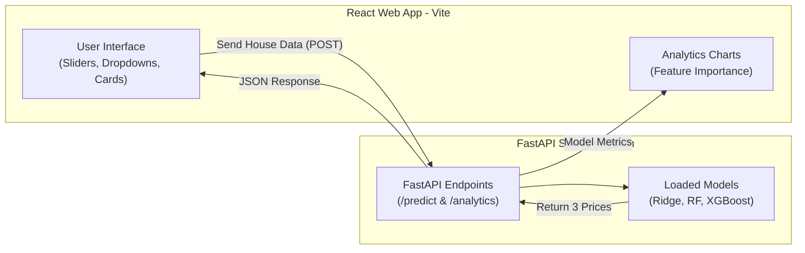

# Project Execution Plan: From Google Colab to Full-Stack Web Application
**Module:** IT3091 - Machine Learning  
**Project:** Ames House Price Prediction & Valuation Analysis  
**Group:** 2026-AI-08K  
**Team Lead:** Atheek M. F (IT24103933)  

---

## 1. The Strategy: Two Clear Milestones

To make this project 100% production-level and conflict-free, we follow two clear milestones:



1. **Milestone 1 (In Colab):** Train all models, validate without data leakage, pick the best model, and save the model files (`.joblib`).
2. **Milestone 2 (On Local / Web):** Build the FastAPI backend to serve the saved models and build the React frontend so users can test and compare all 3 models interactively.

---

## 2. Milestone 1: Complete Google Colab Work

### Goal:
Train the models using [`docs/model_training_phases.md`](./model_training_phases.md) and download the model files to your computer.

### Step-by-Step Colab Checklist:

- [ ] **Step 1.1: Clone & Load Data**
  - Run Cells 1 & 2 in Colab to clone the GitHub repo and load `train.csv` and `test.csv` using Member 3's `load_ames_data()`.
- [ ] **Step 1.2: Set Up Fair Validation**
  - Run Cell 3 to apply `np.log1p(SalePrice)` and set up 5-Fold Cross-Validation (`KFold`).
- [ ] **Step 1.3: Train Baseline & 3 Candidate Models**
  - Baseline (Median Regressor)
  - Model 1: **Ridge Regression** (`configuration='scaled'`, `log_numeric=True`)
  - Model 2: **Random Forest Regressor** (`configuration='unscaled'`)
  - Model 3: **XGBoost Regressor** (`configuration='unscaled'`)
- [ ] **Step 1.4: Generate Model Comparison Table**
  - Record RMSE, MAE, and $R^2$ scores for your SLIIT report.
- [ ] **Step 1.5: Valuation Feature Analysis (Secondary Lens)**
  - Extract and plot the Top 15 features that drive house prices.
- [ ] **Step 1.6: Save and Download Model Artifacts**
  - Run this export cell at the end of your Colab notebook:

```python
import joblib

# Fit final models on all training data (X, y_log)
ridge_pipeline.fit(X, y_log)
rf_pipeline.fit(X, y_log)
xgb_pipeline.fit(X, y_log)

# Save the complete pipelines (including preprocessor + model)
joblib.dump(ridge_pipeline, "ridge_model.joblib")
joblib.dump(rf_pipeline, "random_forest_model.joblib")
joblib.dump(xgb_pipeline, "xgboost_best_model.joblib")

print("✅ All 3 models saved successfully! Download these files now.")
```

### Files You Must Have in Hand After Colab:
1. `ridge_model.joblib`
2. `random_forest_model.joblib`
3. `xgboost_best_model.joblib`
4. `model_comparison_metrics.csv`
5. `submission_xgb.csv` (predictions for test set)

---

## 3. Milestone 2: Build the FastAPI + React Web Application

### Goal:
Build an interactive, production-ready web application where anyone (teachers, real estate agents, or students) can test the models and see live price predictions.

### Architecture Overview:



---

### Step 2.1: Clean Project Directory Structure

We will create two new folders inside your repository: `api/` and `frontend/`.

```text
IT3091-House-Price-Prediction/
├── api/                             <-- FastAPI Python Backend
│   ├── main.py                      <-- API endpoints
│   ├── models/                      <-- Put the 3 .joblib files here
│   │   ├── ridge_model.joblib
│   │   ├── random_forest_model.joblib
│   │   └── xgboost_best_model.joblib
│   └── requirements.txt             <-- fastapi, uvicorn, scikit-learn, xgboost
│
├── frontend/                        <-- Modern React UI (Vite)
│   ├── src/
│   │   ├── components/
│   │   │   ├── HouseForm.jsx        <-- Sliders for house size, quality, etc.
│   │   │   ├── ModelCards.jsx       <-- 3 Cards showing predicted prices
│   │   │   └── AnalyticsChart.jsx   <-- Bar chart for feature importances
│   │   ├── App.jsx                  <-- Main layout
│   │   └── index.css                <-- Modern styling (glassmorphism & dark mode)
│   └── package.json
│
├── notebooks/                       <-- Colab experiments
├── docs/                            <-- All project plans & decision logs
└── README.md
```

---

### Step 2.2: FastAPI Backend Implementation Plan

1. **Load Models into Memory:**
   When FastAPI starts, it loads all 3 `.joblib` files once so predictions are instant (< 50ms).
2. **Endpoint 1: `GET /health`**
   - Returns status `{"status": "healthy", "models_loaded": 3}`.
3. **Endpoint 2: `POST /predict`**
   - Receives house features from React (e.g., Living Area, Overall Quality, Year Built, etc.).
   - Predicts price with **Ridge**, **Random Forest**, and **XGBoost**.
   - Converts from log price back to dollars using `np.expm1()`.
   - Returns all 3 prices plus average and range.
4. **Endpoint 3: `GET /analytics`**
   - Returns model evaluation scores (RMSE, MAE, $R^2$) and top 15 feature importance scores for charts.

---

### Step 2.3: React Frontend Implementation Plan

1. **Input Section:**
   - **Living Area Slider:** 500 sqft to 4,500 sqft.
   - **Overall Quality Rating:** 1 to 10 interactive selector.
   - **Year Built:** Slider / Input (e.g. 1920 to 2010).
   - **Basement Area:** Slider.
   - **Garage Capacity:** 0, 1, 2, 3 cars.
   - **Neighborhood:** Dropdown selector.
2. **Live Model Comparison Display:**
   - Three modern cards:
     - 🔵 **Ridge Regression:** Fast linear estimate.
     - 🟢 **Random Forest:** Tree-based ensemble estimate.
     - ⭐ **XGBoost (Recommended):** Best validated model.
3. **Visual Analytics Tab:**
   - Shows interactive bar chart of **What drives house prices in Ames** (directly presenting your Secondary Lens to the marker!).

---

## 4. How This Wins High Marks in the Assignment

The SLIIT marking rubric requires:
1. **3-Minute YouTube Demo Video:**
   - Instead of just showing code cells scrolling on a screen, you can demonstrate the **live React app**! This will impress the examiners and clearly show the business value.
2. **Evidence-Based Recommendation (10 marks):**
   - Your web app allows real estate agents to compare models side by side, proving that the solution provides real decision support.
3. **Reproducibility & Professional Engineering (10 marks):**
   - Clean separation of ML training (`notebooks/`), API services (`api/`), and frontend (`frontend/`) represents professional software engineering standards.

---

## 5. Execution Summary

| Phase | Task | Primary Location | Output |
| :--- | :--- | :--- | :--- |
| **Phase 1** | Train & cross-validate models | Google Colab | 3 `.joblib` model files + comparison table |
| **Phase 2** | Build FastAPI server | Local `api/` folder | REST API serving predictions |
| **Phase 3** | Build React UI | Local `frontend/` folder | Interactive web dashboard |
| **Phase 4** | Record 3-minute video demo | YouTube / Screen recorder | Final demo presentation |
