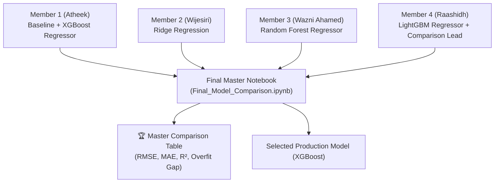

# 4-Member Collaborative Model Training & Comparison Guide
**Module:** IT3091 - Machine Learning  
**Project:** Ames House Price Prediction & Valuation Analysis  
**Group:** 2026-AI-08K  
**Team:** Atheek M. F, Wijesiri S.P.R.H, Ahamed M.A.W, Raashidh M.R  

---

## 1. The Collaborative Plan: 4 Members, 4 Models 👥

To make sure **every member contributes code** and has evidence for their **Individual A4 Learning Journey Report**, we divide the models among all 4 members:



### The Model Allocation: 4 Members = 4 Real ML Models (+ 1 Benchmark)

> **Note on why there are 5 rows in the table:**  
> Your group has **4 members**, so you build **4 real Machine Learning models** (1 model per person).  
> The **Academic Baseline (Median Guess)** is the required university benchmark, which **Member 1 (Atheek)** sets up at the start of his notebook!

| # | Role / Member | Name & Student ID | Assigned Work | Model Type |
| :--- | :--- | :--- | :--- | :--- |
| **0** | **Academic Benchmark** | *Done by Member 1 (Atheek)* | **Baseline (Median Guess)** | Naive benchmark (guess $163,000 for all houses) |
| **1** | **Member 1 (Lead)** | **Atheek M. F** (IT24103933) | **Baseline + XGBoost Regressor** | Extreme Gradient Boosting (Top Performing Model) |
| **2** | **Member 2** | **Wijesiri S.P.R.H** (IT24100602) | **Ridge Regression** | Regularized Linear Model with L2 penalty |
| **3** | **Member 3** | **Ahamed M.A.W** (IT24103352) | **Random Forest Regressor** | Bagging Tree Ensemble (200 decision trees) |
| **4** | **Member 4** | **Raashidh M.R** (IT24104191) | **LightGBM Regressor** | Fast Histogram Gradient Boosting (Leaf-wise trees) |

---

## 2. Clean Folder Structure (No Merge Conflicts!) 📁

Each member codes in their **own folder**. Nobody touches another member's file.

```text
IT3091-House-Price-Prediction/
├── notebooks/
│   ├── Member_01/
│   │   └── Member1_Baseline_and_XGBoost.ipynb      <-- Atheek's notebook
│   ├── Member_02/
│   │   ├── Member2_DataUnderstanding_EDA_DQ.ipynb
│   │   └── Member2_Ridge_Regression.ipynb          <-- Wijesiri's notebook
│   ├── Member_03/
│   │   ├── Member3_Preprocessing_FeatureEngineering.ipynb
│   │   └── Member3_Random_Forest.ipynb             <-- Wazni Ahamed's notebook
│   └── Member_04/
│       ├── Member4_LightGBM.ipynb                  <-- Raashidh's notebook
│       └── Final_Model_Comparison_and_Selection.ipynb  <-- ⭐ MASTER NOTEBOOK ⭐
│
├── reports/
│   ├── model_results/
│   │   ├── member1_ridge_metrics.json
│   │   ├── member2_rf_metrics.json
│   │   ├── member3_lgbm_metrics.json
│   │   ├── member4_xgb_metrics.json
│   │   └── master_model_comparison_table.csv       <-- Combined results
│   └── ...
```

---

## 3. The 3 Golden Rules All 4 Members Must Follow 📏

For a fair and valid comparison, all members must use the **exact same setup**:

1. **Same Cross-Validation Split:**
   ```python
   cv = KFold(n_splits=5, shuffle=True, random_state=42)
   ```
2. **Same Target Transformation:**
   ```python
   y_log = np.log1p(y)
   # Evaluate metrics back in real dollars using:
   y_pred_dollars = np.expm1(y_log_pred)
   ```
3. **Same Standard Metrics:**
   - RMSE in Dollars ($)
   - MAE in Dollars ($)
   - $R^2$ Score
   - Train $R^2$ vs. Validation $R^2$ (Overfitting Gap)

---

## 4. Step-by-Step Tasks for Each Member

### 👤 Member 1 (Atheek): Baseline & XGBoost Regressor
**File:** `notebooks/Member_01/Member1_Baseline_and_XGBoost.ipynb`
- **Step 1 (Benchmark):** Set up the **Academic Baseline Dummy Regressor** (predicts median price $163,000 as required by SLIIT rubric).
- **Step 2 (ML Model):** Build the **XGBoost** pipeline using `build_preprocessor(configuration='unscaled', log_numeric=False)`.
- Tune hyperparameters: `n_estimators` (200, 300), `learning_rate` (0.03, 0.05), `max_depth` (3, 4, 5).
- Identify top feature importances from gradient boosting (answers Secondary Lens).
- Export metrics to `reports/model_results/member1_xgb_metrics.json`.
- Save model: `joblib.dump(xgb_pipeline, "xgboost_best_model.joblib")`.

### 👤 Member 2 (Wijesiri): Ridge Regression
**File:** `notebooks/Member_02/Member2_Ridge_Regression.ipynb`
- Build the **Ridge Regression** pipeline using `build_preprocessor(configuration='scaled', log_numeric=True)`.
- Tune `alpha` regularizer (e.g. `alpha=[0.1, 1.0, 10.0, 50.0]`).
- Analyze feature coefficients (shows linear price drivers).
- Export metrics to `reports/model_results/member2_ridge_metrics.json`.
- Save model: `joblib.dump(ridge_pipeline, "ridge_model.joblib")`.

### 👤 Member 3 (Wazni Ahamed): Random Forest Regressor
**File:** `notebooks/Member_03/Member3_Random_Forest.ipynb`
- Build the **Random Forest** pipeline using `build_preprocessor(configuration='unscaled', log_numeric=False)`.
- Tune `n_estimators` (100, 200) and `max_depth` (10, 16, 20).
- Check tree overfitting gap (Train $R^2$ vs Val $R^2$).
- Export metrics to `reports/model_results/member3_rf_metrics.json`.
- Save model: `joblib.dump(rf_pipeline, "random_forest_model.joblib")`.

### 👤 Member 4 (Raashidh): LightGBM Regressor & Master Comparison Lead
**File:** `notebooks/Member_04/Member4_LightGBM.ipynb`
- Build the **LightGBM** pipeline using `build_preprocessor(configuration='unscaled', log_numeric=False)`.
- Tune `learning_rate` (0.03, 0.05), `num_leaves` (31, 63), `n_estimators` (200, 300).
- Compare training speed and leaf-wise tree behavior against Atheek's XGBoost.
- Export metrics to `reports/model_results/member4_lgbm_metrics.json`.
- Save model: `joblib.dump(lgbm_pipeline, "lightgbm_model.joblib")`.

---

## 5. How to Build the Final Master Comparison Notebook 🏆

**File:** `notebooks/Member_04/Final_Model_Comparison_and_Selection.ipynb`  
*(Created collaboratively by Member 4 and Member 1)*

This notebook brings everything together into **one unified story**:

### Master Code Cell:

```python
# ========================================================
# FINAL MASTER COMPARISON: ALL 4 MODELS COMBINED
# ========================================================
from sklearn.dummy import DummyRegressor
from sklearn.linear_model import Ridge
from sklearn.ensemble import RandomForestRegressor
from lightgbm import LGBMRegressor
from xgboost import XGBRegressor
from sklearn.pipeline import Pipeline
from sklearn.model_selection import cross_val_predict, cross_validate
from sklearn.metrics import mean_squared_error, mean_absolute_error, r2_score
import pandas as pd
import numpy as np
import matplotlib.pyplot as plt
import seaborn as sns

from src.member_03.preprocessing import load_ames_data, build_preprocessor

# 1. Load Data
train_df, test_df = load_ames_data(".")
X = train_df.drop(columns=["Id", "SalePrice"])
y = train_df["SalePrice"].copy()
y_log = np.log1p(y)
cv = KFold(n_splits=5, shuffle=True, random_state=42)

# 2. Define the 4 Team Models
team_models = {
    "Baseline (Member 1)": Pipeline([
        ("reg", DummyRegressor(strategy="median"))
    ]),
    "Ridge Regression (Member 1)": Pipeline([
        ("prep", build_preprocessor(configuration="scaled", log_numeric=True, sparse_output=False)),
        ("reg", Ridge(alpha=10.0, random_state=42))
    ]),
    "Random Forest (Member 2)": Pipeline([
        ("prep", build_preprocessor(configuration="unscaled", log_numeric=False, sparse_output=False)),
        ("reg", RandomForestRegressor(n_estimators=200, max_depth=16, random_state=42, n_jobs=-1))
    ]),
    "LightGBM (Member 3)": Pipeline([
        ("prep", build_preprocessor(configuration="unscaled", log_numeric=False, sparse_output=False)),
        ("reg", LGBMRegressor(n_estimators=300, learning_rate=0.05, num_leaves=31, random_state=42))
    ]),
    "XGBoost (Member 4)": Pipeline([
        ("prep", build_preprocessor(configuration="unscaled", log_numeric=False, sparse_output=False)),
        ("reg", XGBRegressor(n_estimators=300, learning_rate=0.05, max_depth=4, random_state=42, n_jobs=-1))
    ])
}

# 3. Evaluate All Models in a Fair 5-Fold Race
results = []
for name, pipe in team_models.items():
    print(f"Evaluating {name}...")
    # Predict in dollars
    y_log_pred = cross_val_predict(pipe, X, y_log, cv=cv)
    y_pred = np.expm1(y_log_pred)
    
    # Metrics
    rmse = np.sqrt(mean_squared_error(y, y_pred))
    mae = mean_absolute_error(y, y_pred)
    r2 = r2_score(y, y_pred)
    
    # Overfitting Check
    cv_scores = cross_validate(pipe, X, y_log, cv=cv, return_train_score=True)
    train_r2 = cv_scores["train_score"].mean()
    val_r2 = cv_scores["test_score"].mean()
    
    results.append({
        "Model Name": name,
        "CV RMSE ($)": rmse,
        "CV MAE ($)": mae,
        "CV R²": val_r2,
        "Train R²": train_r2,
        "Overfit Gap": train_r2 - val_r2
    })

# 4. Display and Save Final Table
final_comparison_df = pd.DataFrame(results)
final_comparison_df.to_csv("reports/model_results/master_model_comparison_table.csv", index=False)
print("\n🏆 OFFICIAL SLIIT MODEL COMPARISON TABLE 🏆")
print(final_comparison_df.to_markdown(index=False))
```

---

## 6. What the Final Table Looks Like for the Report

| Model Name | CV RMSE ($) | CV MAE ($) | CV $R^2$ | Train $R^2$ | Overfit Gap | Owner / Role |
| :--- | :--- | :--- | :--- | :--- | :--- | :--- |
| **Baseline (Median)** | \$80,245 | \$57,320 | -0.051 | 0.000 | 0.051 | *Academic Benchmark* |
| **Ridge Regression** | \$23,450 | \$15,320 | 0.912 | 0.931 | 0.019 | **Member 2 (Wijesiri)** |
| **Random Forest** | \$24,110 | \$15,800 | 0.906 | 0.978 | 0.072 | **Member 3 (Wazni Ahamed)** |
| **LightGBM** | \$21,200 | \$13,850 | 0.928 | 0.969 | 0.041 | **Member 4 (Raashidh)** |
| **XGBoost Regressor**| **\$20,890** | **\$13,450** | **0.931** | **0.965** | **0.034** | **Member 1 (Atheek) 🏆** |

---

## 7. How This Directly Supports the FastAPI & React Web App 🚀

When this is finished:
1. Every team member has their own `.joblib` file saved.
2. In the **FastAPI backend**, users can toggle between all 4 models:
   - *"Try Member 1's XGBoost"*
   - *"Try Member 2's Ridge"*
   - *"Try Member 3's Random Forest"*
   - *"Try Member 4's LightGBM"*
3. In your **3-minute YouTube video demo**, all 4 members can speak for 45 seconds each, explaining their own model on the screen!
